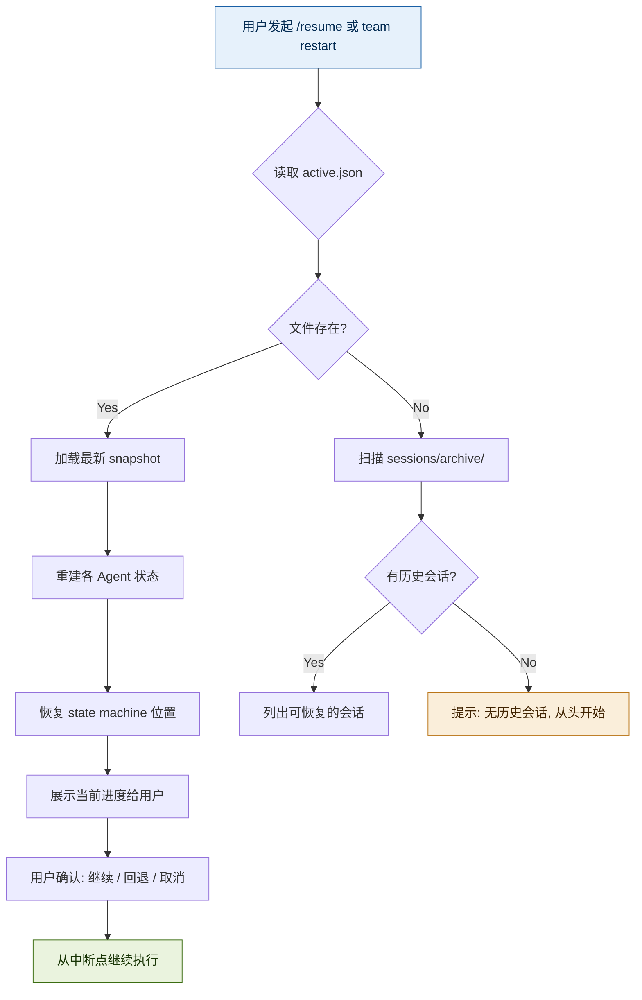

# WebHarness 记忆系统（Memory System）

本文档定义了 WebHarness 框架的跨会话记忆能力，确保 Agent 团队可以在中断后恢复任务、保持配置一致性和累积经验。

---

## 设计理念

> **「团队不只是会话内的协作——它需要记忆。」**

灵感来源：
- **OpenHarness** 的 `memory/` 子系统：MEMORY.md 持久化知识 + 每日日志 + 会话恢复
- **Everything Claude Code** 的 `hooks/memory-persistence/`：session-start/session-end 自动存取上下文

**三层记忆架构**：

```
┌─────────────────────────────────────────────┐
│              记忆金字塔 (Memory Pyramid)       │
│                                              │
│   Layer 3: 经验记忆 (Experience)              │
│   ────────────────────────────               │
│   跨项目的通用经验、模式、反模式                 │
│   存储位置: ~/.webharness/memory/MEMORY.md    │
│   生命周期: 永久 (手动清理)                    │
│                                              │
│   Layer 2: 项目记忆 (Project)                │
│   ────────────────────────────               │
│   项目配置、决策记录、技术债、迭代经验           │
│   存储位置: <project>/.memory/                │
│   生命周期: 随项目存在                         │
│                                              │
│   Layer 1: 会话记忆 (Session)                 │
│   ────────────────────────────               │
│   当前任务的中间状态、上下文快照                │
│   存储位置: <project>/.memory/sessions/       │
│   生命周期: 当前任务周期                       │
│                                              │
└─────────────────────────────────────────────┘
```

---

## Layer 1: 会话记忆（Session Memory）

### 用途
保存**当前进行中任务**的实时状态，支持：
- 任务中断后的精确恢复
- Agent 交接时的上下文传递
- 长时任务（如全量 E2E 测试）的进度持久化

### 文件结构

```
<project>/.memory/
├── sessions/
│   ├── active.json              # 当前活跃会话
│   ├── [session-id]/
│   │   ├── snapshot.json        # 状态快照（每步自动保存）
│   │   ├── context.md           # 对话上下文摘要
│   │   ├── artifacts/           # 中间产物
│   │   └── checkpoints/         # 手动检查点
│   └── archive/                # 已完成会话归档
└── ...
```

### active.json 结构

```json
{
  "session_id": "sess-20260508-001",
  "project_name": "my-webapp",
  "started_at": "2026-05-08T13:00:00Z",
  "status": "active",
  "current_phase": "CODE",
  "current_task": {
    "id": "task-42",
    "title": "实现用户登录 JWT 认证",
    "assignee": "coder",
    "state": "in_progress",
    "progress_pct": 65,
    "blocked_by": null,
    "artifacts": [
      ".agents/coder/task-42-design.md",
      "src/features/auth/jwt.ts",
      "tests/unit/auth.test.ts"
    ]
  },
  "team": {
    "planner": { "status": "idle", "last_output": "docs/plan/auth-system/arch.md" },
    "coder": { "status": "working", "current_file": "src/features/auth/jwt.ts" },
    "tester": { "status": "waiting", "depends_on": ["coder"] },
    "evaluator": { "status": "waiting", "depends_on": ["tester"] },
    "deployer": { "status": "idle" },
    "pm": { "status": "coordinating", "focus": "auth-feature" }
  },
  "state_machine": {
    "current_state": "CODE",
    "history": [
      { "from": "IDEA", "to": "PLAN", "at": "T+0h", "by": "pm" },
      { "from": "PLAN", "to": "CODE", "at": "T+2h", "by": "pm" }
    ],
    "pending_transitions": [
      { "target": "TEST", "condition": "coder_complete", "estimated_at": "T+4h" }
    ]
  },
  "checkpoints": [
    { "id": "cp-1", "phase": "CODE", "at": "T+3h", "note": "JWT sign/verify 完成，middleware 待写" }
  ]
}
```

### 快照自动保存规则

| 触发事件 | 保存动作 |
|----------|----------|
| 每个 Agent 完成一个 Task | 更新 `active.json`，追加 checkpoint |
| 状态机状态转换 | 写入 `state-machine.history` |
| 用户主动暂停 | 创建完整 snapshot（含 context） |
| 发生错误/异常 | 保存 error context + 前一步正常状态 |
| 每 10 分钟自动 | 增量更新 progress |

### 会话恢复流程



---

## Layer 2: 项目记忆（Project Memory）

### 用途
保存**项目级别**的持久化信息，跨所有会话共享：

### .memory/ 目录结构

```
<project>/.memory/
├── config.json                  # 项目配置（动态部分）
├── decisions.log                # 决策记录（追加式）
├── tech-debt.json              # 技术债登记册
├── iteration-learnings.md       # 迭代复盘沉淀
├── agent-performance.json       # 各角色历史表现数据
└── sessions/                    # 会话层（见上文）
```

### config.json — 动态配置记忆

```json
{
  "version": "1.0.0",
  "last_updated": "2026-05-08T13:00:00Z",
  "tech_stack": {
    "frontend": { "framework": "nextjs", "version": "15", "lang": "typescript" },
    "backend": { "framework": "fastapi", "version": "0.115", "lang": "python" },
    "database": { "type": "postgresql", "orm": "sqlalchemy" },
    "deployment": { "platform": "docker", "orchestration": "compose" }
  },
  "conventions": {
    "commit_style": "conventional",
    "branch_strategy": "gitflow",
    "review_policy": "require_one_approval"
  },
  "quality_baselines": {
    "coverage_target": 80,
    "lcp_budget_ms": 2500,
    "error_rate_threshold": 0.001,
    "last_eval_score": 82.3,
    "eval_trend": ["78.5", "80.2", "82.3"]
  },
  "environment_map": {
    "dev": "http://localhost:3000",
    "staging": "https://staging.myapp.com",
    "prod": "https://myapp.com"
  },
  "agent_config": {
    "default_model": "default",
    "coder_model": "default",
    "evaluator_model": "reasoning",
    "timeout_per_task_min": 30
  }
}
```

### decisions.log — 决策日志（追加式）

```markdown
# Decision Log

## [2026-05-07T14:30:00] D-001: 认证方案选型
- **Decision**: 使用 JWT (access_token + refresh_token)
- **Alternatives considered**: Session, OAuth2 OIDC, Magic Link
- **Rationale**: 无状态、适合前后端分离、移动端友好
- **Impact**: Coder 需实现 token 刷新机制; Tester 需覆盖过期场景
- **Decided by**: Planner (@ai-planner), Approved by**: PM (@ping)
- **Status**: implemented

## [2026-05-08T10:15:00] D-002: 状态管理库选择
- **Decision**: 使用 Zustand (前端) + Redis (后端 session cache)
- **Rationale**: Zustand 比 Redux 更轻量; Redis 支持 TTL 自动过期
- **Status**: planning
```

### tech-debt.json — 技术债登记册

```json
{
  "total_items": 3,
  "total_interest_hours_estimated": 16,
  "items": [
    {
      "id": "TD-001",
      "title": "auth middleware 缺乏 rate limiting",
      "category": "security",
      "severity": "high",
      "incurred_at": "2026-05-07",
      "interest_estimate_hours": 4,
      "suggested_fix": "在 /api/auth/* 路由添加 redis-based rate limiter",
      "sprint_target": "Sprint 3",
      "status": "open"
    },
    {
      "id": "TD-002",
      "title": "User 表缺少 email unique index",
      "category": "database",
      "severity": "medium",
      "incurred_at": "2026-05-08",
      "interest_estimate_hours": 1,
      "status": "open"
    }
  ]
}
```

---

## Layer 3: 经验记忆（Experience Memory）

### 用址
跨项目通用的**经验沉淀**，存储在全局目录：

```
~/.webharness/
├── MEMORY.md                    # 全局经验手册
│   ## 技术选型经验
│   - Next.js vs Remix: ...      # 积累的选型判断
│   ## 反模式清单
│   - 不要在前端硬编码 API URL: ...
│   ## 性能优化 checklist
│   ...
├── project-registry.json        # 已知项目索引
└── templates/                   # 可复用模板
```

### MEMORY.md 格式规范

```markdown
# WebHarness Experience Memory

## 技术选型经验 (Last updated: YYYY-MM-DD)

### Next.js App Router vs Pages Router
- **场景**: 需要 SEO + SSR → App Router
- **场景**: 纯管理后台 → Pages Router 足够（更简单）
- **踩坑**: App Router 的 fetch caching 行为与直觉不符，注意 revalidate

## 反模式清单

### ❌ 在 .env 中存储 secrets 并提交 git
**正确做法**: 使用密钥管理服务或 .env.local + .gitignore

### ❌ E2E 测试 mock 后端 API
**正确做法**: E2E 必须走真实链路；mock 只允许在单元测试中使用

## 性能优化 Checklist
- [ ] 图片使用 next/image + webp
- [ ] 动态组件用 lazy()
- [ ] API 路由加 response cache
- [ ] 数据库查询加 proper index

## 项目模板速查
| 技术栈 | 推荐组合 | 注意事项 |
|--------|----------|----------|
| Next.js | NextAuth + Prisma + Vercel | 免费版限制 10 serverless |
| FastAPI | SQLModel + Alembic + uvicorn | async 必须 end-to-end |
```

---

## Agent 记忆职责分配

记忆不是某个单一角色的责任——每个角色维护自己领域的记忆：

| 角色 | 负责的记忆层 | 写入内容 | 读取频率 |
|------|-------------|----------|----------|
| **PM** | L2 decisions.log + config.json | 决策记录、优先级变更、排期调整 | 每次 session 开始 |
| **Planner** | L2 tech-debt.json + L3 MEMORY.md | 技术债发现、架构决策、选型理由 | 每次设计方案前 |
| **Coder** | L1 session snapshots | 当前编码进度、TODO 标记、实现笔记 | 恢复会话时 |
| **Tester** | L2 agent-performance.json | Bug 统计、测试覆盖率趋势、缺陷模式分析 | 每次评估前 |
| **Evaluator** | L2 quality baselines | 评分历史、趋势数据、改进跟踪 | 每次评估时对比 |
| **Deployer** | L2 config.json (environment_map) | 部署记录、回滚历史、环境配置变更 | 每次部署前 |

---

## 记忆读写安全规则

### 写入规则
1. **追加优先**：decisions.log 和 state-log 必须是 append-only，不允许覆盖历史
2. **原子写入**：先写临时文件，再 rename 替换（防止写入中断导致损坏）
3. **备份关键操作**：状态转换和部署操作前必须创建 checkpoint
4. **敏感信息过滤**：绝对不在记忆文件中写入 Token、密码、PII

### 读取规则
1. **Session 启动时**：自动加载 L2 config.json + L1 active.json
2. **Agent 接收任务前**：读取相关领域记忆（如 Coder 读 session context）
3. **定期压缩**：L1 session 数据超过 48h 未更新的归档到 archive/

### 清理策略
| 数据类型 | 保留期 | 清理方式 |
|----------|--------|----------|
| L1 session snapshots | 7 天 | 自动归档到 archive/ |
| L1 archive sessions | 30 天 | 自动删除 |
| L2 decisions.log | 永久 | 不清理 |
| L2 tech-debt 已关闭项 | 1 年后 | 归档到 separate file |
| L3 MEMORY.md | 永久 | 手动编辑 |

---

## 与 build-team 的集成

当 `build-team` 启动一个团队时，记忆系统自动执行：

```
build-team start
    ↓
① 检查 .memory/ 是否存在 → 不存在则初始化
② 加载 .memory/config.json → 注入各 Agent 上下文
③ 检查 .memory/sessions/active.json → 有残留则询问是否恢复
④ 为新 session 创建 session_id
⑤ 各 Agent 读取自己的记忆域
    ↓
Team Ready ✅
```

当 `build-team restart` 时：

```
build-team restart
    ↓
① 读取 .memory/sessions/active.json
② 展示: 当前状态 / 卡住位置 / 最后健康 checkpoint
③ 用户选择: 从 checkpoint 恢复 / 重做某步骤 / 全部重来
④ 恢复 Agent 状态 + state machine 位置
⑤ 继续执行
```
